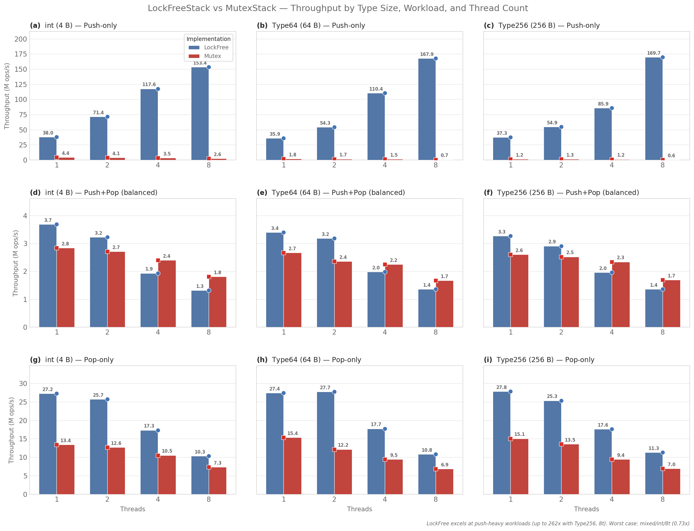

# Lock-Free Stack — Design Documentation

This directory implements a **lock-free stack** built on top of a **lock-free free list**
(static pool allocator). Both data structures use tagged pointers/indices for ABA
prevention and rely solely on C++ `std::atomic` for synchronisation.

---

## FreeList — Design

`FreeList<T, Capacity>` is a fixed-capacity, lock-free pool allocator. It pre-allocates
a contiguous array of `Capacity` nodes, each a `union` of `T data` and `TaggedIndex next`.
When a node is in-use its `data` member is active; when it is free, the same storage
holds the index of the next free node, forming an implicit singly-linked free list.

### Internal structure

```
FreeList<int, 4>        nodes_ (array)
┌──────────┐     ┌──────────┐     ┌──────────┐     ┌──────────┐
│  0: data │ ──► │  1: data │ ──► │  2: data │ ──► │  3: data │
│    next  │     │    next  │     │    next  │     │    next  │  ← TaggedIndex
└──────────┘     └──────────┘     └──────────┘     └──────────┘
   head ──► 0        1               2               3 (end sentinel = Capacity)
```

The head `std::atomic<TaggedIndex>` points to the first free node. Each free node's
`next` field points to the subsequent free node. `TaggedIndex(Capacity)` serves as
the end-of-list sentinel — attempting to allocate when the list is empty returns `nullptr`.

### Allocation (CAS loop)

1. Load `head` → `old_head`
2. If `old_head.index == Capacity` → return `nullptr` (pool exhausted)
3. Read `nodes_[old_head.index].next.get_index()` → `next_idx`
4. Prepare `new_head = TaggedIndex(old_head.next_tag(), next_idx)`
5. `compare_exchange_strong(old_head, new_head)` — retry on failure
6. Placement-new construct `T` in `nodes_[index].data`

### Deallocation (CAS loop)

1. Destruct `T` via `ptr->~T()`
2. Compute the node index by pointer arithmetic
3. Load `head` → `old_head`
4. Set `nodes_[index].next = TaggedIndex(0, old_head.get_index())`
5. CAS `head` from `old_head` to `TaggedIndex(old_head.next_tag(), index)`

---

## The ABA Problem

The ABA problem occurs in lock-free CAS-based data structures when a pointer (or index)
is read twice and appears unchanged between the two reads, but the memory it points to
has been freed and reallocated in the meantime.

### Concrete example with a stack

Consider a lock-free stack with nodes `A → B → C` and head pointing to `A`.

```
Thread 1                                        Thread 2
─────────                                       ─────────
old_head = head.load()  → A
                                                pop() removes A
                                                push(D) → allocates new node D
                                                  (which coincidentally reuses A's address)
                                                  D → B → C
                                                head = D
CAS(A → B)
  ── succeeds! head = B
  ── *BUT* A is no longer in the list —
      the CAS should have failed!
```

Thread 1's CAS succeeds because the value at `head` is still `A` (by address), even
though `A` was freed and reallocated as `D` between the load and the CAS. The stack
is now corrupt — `B` is treated as the head, but `A` (now `D`) is lost.

### How tags solve ABA

Instead of storing a raw pointer/index, we store a **tagged pair** `(pointer, tag)`.
The tag is incremented on every successful write to the atomic location.

```cpp
class TaggedIndex {
    uint32_t index;  // 0 … Capacity
    uint32_t tag;    // incremented on every CAS success
};

TaggedIndex(prev_tag + 1, new_index)
```

Each CAS now operates on a 64-bit value (32-bit index + 32-bit tag). When Thread 2
modifies the head (pop then push), the tag is incremented. Thread 1's `old_head`
has a stale tag, so the CAS fails and Thread 1 retries.

```
Thread 1: old_head = (index=A, tag=5)
Thread 2: head changes to (index=D, tag=6)
Thread 1: CAS((A,5) → (B,6)) → FAILS because tag 5 ≠ 6
```

`TaggedIndex` uses a 32-bit tag that wraps around after 2³² increments – more than
enough for any practical workload. The same mechanism applies to `TaggedPtr` used
in the lock-free stack, which pairs a 64-bit pointer with a 64-bit tag for 128-bit
CAS operations (`cmpxchg16b`).

---

## LockFreeStack — Design

`LockFreeStack<T, Capacity>` is a bounded, lock-free LIFO stack. It allocates nodes
from a `FreeList` (the pool allocator) and uses a `TaggedPtr` as the atomic head
pointer to prevent ABA.

```
head (TaggedPtr)
   │
   ▼
┌──────────┐      ┌──────────┐      ┌──────────┐
│  Node 5  │ ──►  │  Node 3  │ ──►  │  Node 1  │ ──► ...
│  data    │      │  data    │      │  data    │
│  next    │      │  next    │      │  next    │
└──────────┘      └──────────┘      └──────────┘
```

Each `Node` contains:
- `T data` — the stored value
- `TaggedPtr<Node> next` — pointer to the next node (with its own embedded tag)

### Push

1. Allocate a `Node` from the `FreeList`. If full → no-op.
2. Move/emplace the value into `node->data`.
3. CAS loop: load `head`, set `node->next = head`, CAS head to `(node, tag+1)`.

```
node->next = old_head
head.CAS(old_head → (node, old_head.next_tag()))
```

### Pop

1. CAS loop: load `head`. If null → return `std::nullopt`.
2. Prepare `new_head = (old_head.get_ptr()->next, old_head.next_tag())`.
3. CAS head from `old_head` to `new_head`.
4. Extract the value via move.
5. Deallocate the node back to the `FreeList`.

```
new_head = (old_head.get_ptr()->next, old_head.next_tag())
head.CAS(old_head → new_head)
value = std::move(old_head.get_ptr()->data)
free_list.deallocate(old_head.get_ptr())
```

### 128-bit CAS

`TaggedPtr<T>` is `alignas(16)` and exactly 16 bytes (8-byte pointer + 8-byte tag).
`std::atomic<TaggedPtr<Node>>` uses `cmpxchg16b` on x86-64, performing a single,
atomic 128-bit CAS. This ensures the pointer and tag are updated atomically together.

The `Atomic128` C++20 concept enforces:
```cpp
template <typename T>
concept Atomic128 = requires {
    requires sizeof(T) == 16;
    requires alignof(T) == 16;
};
```

---

## Comparison with Boost.Lockfree

[Boost.Lockfree](https://www.boost.org/doc/libs/1_87_0/doc/html/lockfree.html) is
the de-facto standard lock-free data structure library in C++. Both this
implementation and Boost.Lockfree share the same foundational techniques:

| Aspect | This implementation | Boost.Lockfree |
|--------|-------------------|----------------|
| **Stack algorithm** | Treiber stack (CAS on head pointer) | Treiber stack |
| **Free-list** | Fixed-size array pool, lock-free CAS on head index | Node-based pool, lock-free CAS on head pointer |
| **ABA prevention** | `TaggedIndex` (32+32 bit) / `TaggedPtr` (64+64 bit) | `tagged_ptr` (pointer + integer tag) |
| **Capacity** | Compile-time fixed (`Capacity` template parameter) | Configurable via `boost::lockfree::capacity<>` or dynamic |
| **Allocation** | Pre-allocated array, no heap after construction | Free-list with optional dynamic allocation fallback |
| **128-bit CAS** | `alignas(16)` + `std::atomic<TaggedPtr>` → `cmpxchg16b` | Platform-adaptive: pointer packing on x86-64, 16-bit index on 32-bit |
| **Wait-free** | No | `spsc_queue` is wait-free; stack and queue are lock-free |
| **Queue** | Not implemented | `boost::lockfree::queue` (Michael-Scott) |

### Design differences

**Memory model.** Boost.Lockfree's free-list is a linked list of dynamically
allocated nodes. This allows unbounded growth but introduces a blocking path
when the operating system allocator is called. Our `FreeList` pre-allocates a
contiguous array at construction time — no heap allocation occurs after that,
making it suitable for real-time or embedded environments where allocation is
prohibited.

**ABA prevention on 32-bit.** Boost.Lockfree handles platforms without
double-width CAS by exploiting unused address bits (e.g., 48-bit address space
on x86-64 leaves 16 bits for a tag), or by using 16-bit indices into a
fixed-size array when `fixed_sized` is configured. Our implementation takes the
latter approach universally for `FreeList` (`TaggedIndex`) and requires
`alignas(16)` + `cmpxchg16b` for the stack's `TaggedPtr`.

**No hazard pointers / RCU.** Neither implementation uses hazard pointers or
epoch-based reclamation. Boost.Lockfree simply never returns memory to the OS;
this implementation uses a static pool. Both avoid the classic lock-free memory
reclamation problem by design.

---

## Benchmark Results

### Methodology

- **Types tested:** `int` (4 B), `Type64` (64 B), `Type256` (256 B)
- **Thread counts:** 1, 2, 4, 8
- **Workloads:**
  - *Push-only* — all threads push simultaneously
  - *Pop-only* — all threads pop from a pre-filled stack
  - *Mixed* — each thread does a push+pop pair (balanced)
- **Hardware:** x86-64, clang-cl, C++23
- **Metric:** total throughput (operations per second)

### Results table

| Type | Threads | Workload | LockFree (ops/s) | Mutex (ops/s) | Speedup |
|------|---------|----------|------------------|---------------|---------|
| int (4 B) | 1 | push | 38.01 M | 4.39 M | 8.66× |
| int (4 B) | 1 | mixed | 3.68 M | 2.84 M | 1.30× |
| int (4 B) | 1 | pop | 27.24 M | 13.41 M | 2.03× |
| int (4 B) | 2 | push | 71.40 M | 4.09 M | 17.46× |
| int (4 B) | 2 | mixed | 3.22 M | 2.71 M | 1.19× |
| int (4 B) | 2 | pop | 25.67 M | 12.65 M | 2.03× |
| int (4 B) | 4 | push | 117.64 M | 3.50 M | 33.62× |
| int (4 B) | 4 | mixed | 1.93 M | 2.40 M | 0.80× |
| int (4 B) | 4 | pop | 17.32 M | 10.54 M | 1.64× |
| int (4 B) | 8 | push | 153.41 M | 2.62 M | 58.56× |
| int (4 B) | 8 | mixed | 1.32 M | 1.81 M | 0.73× |
| int (4 B) | 8 | pop | 10.33 M | 7.33 M | 1.41× |
| Type64 (64 B) | 1 | push | 35.95 M | 1.75 M | 20.53× |
| Type64 (64 B) | 1 | mixed | 3.39 M | 2.66 M | 1.28× |
| Type64 (64 B) | 1 | pop | 27.40 M | 15.38 M | 1.78× |
| Type64 (64 B) | 2 | push | 54.32 M | 1.67 M | 32.50× |
| Type64 (64 B) | 2 | mixed | 3.18 M | 2.36 M | 1.35× |
| Type64 (64 B) | 2 | pop | 27.69 M | 12.16 M | 2.28× |
| Type64 (64 B) | 4 | push | 110.36 M | 1.51 M | 73.20× |
| Type64 (64 B) | 4 | mixed | 1.98 M | 2.25 M | 0.88× |
| Type64 (64 B) | 4 | pop | 17.74 M | 9.46 M | 1.87× |
| Type64 (64 B) | 8 | push | 167.89 M | 0.71 M | 235.35× |
| Type64 (64 B) | 8 | mixed | 1.36 M | 1.67 M | 0.82× |
| Type64 (64 B) | 8 | pop | 10.85 M | 6.86 M | 1.58× |
| Type256 (256 B) | 1 | push | 37.25 M | 1.24 M | 29.98× |
| Type256 (256 B) | 1 | mixed | 3.27 M | 2.60 M | 1.26× |
| Type256 (256 B) | 1 | pop | 27.80 M | 15.07 M | 1.85× |
| Type256 (256 B) | 2 | push | 54.92 M | 1.25 M | 43.84× |
| Type256 (256 B) | 2 | mixed | 2.91 M | 2.52 M | 1.15× |
| Type256 (256 B) | 2 | pop | 25.33 M | 13.55 M | 1.87× |
| Type256 (256 B) | 4 | push | 85.90 M | 1.19 M | 72.01× |
| Type256 (256 B) | 4 | mixed | 1.96 M | 2.34 M | 0.84× |
| Type256 (256 B) | 4 | pop | 17.58 M | 9.44 M | 1.86× |
| Type256 (256 B) | 8 | push | 169.71 M | 0.65 M | 261.80× |
| Type256 (256 B) | 8 | mixed | 1.36 M | 1.69 M | 0.80× |
| Type256 (256 B) | 8 | pop | 11.30 M | 6.96 M | 1.62× |

### Visual overview



*Generated by `plot_bench.py` — a 3×3 grid of grouped bar charts showing throughput
(M ops/s) for each combination of type size (columns) and workload (rows), with
LockFree (blue) vs Mutex (red) side by side per thread count.*

### Key observations

1. **Push-only (lock-free dominates).** The lock-free stack achieves 8–260× higher
   throughput than the mutex-based stack under push-only workloads. The mutex becomes
   a serialisation bottleneck, while the lock-free CAS scales with the number of
   concurrent pushers.

2. **Pop-only (lock-free ~1.5–2.3×).** The lock-free stack still wins, but the
   advantage is smaller. Both implementations must drain a shared resource; the
   lock-free version benefits from fine-grained CAS retries instead of coarse
   lock/unlock.

3. **Mixed (balanced push+pop).** At 1–2 threads the lock-free stack shows a modest
   advantage (~1.2–1.3×). At ≥4 threads the mutex stack is actually faster
   (0.7–0.9×). This is because the mutex version holds the lock for the entire
   push+pop pair, while the lock-free version performs two separate CAS operations
   under high contention, increasing retry overhead.

4. **Type size has minimal impact.** Throughput is largely independent of whether
   the payload is 4 bytes or 256 bytes — the bottleneck is the CAS/tag overhead,
   not the data copy.
